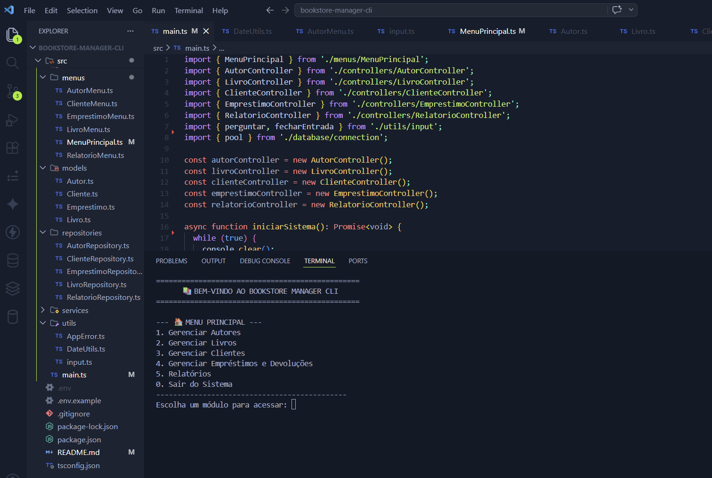
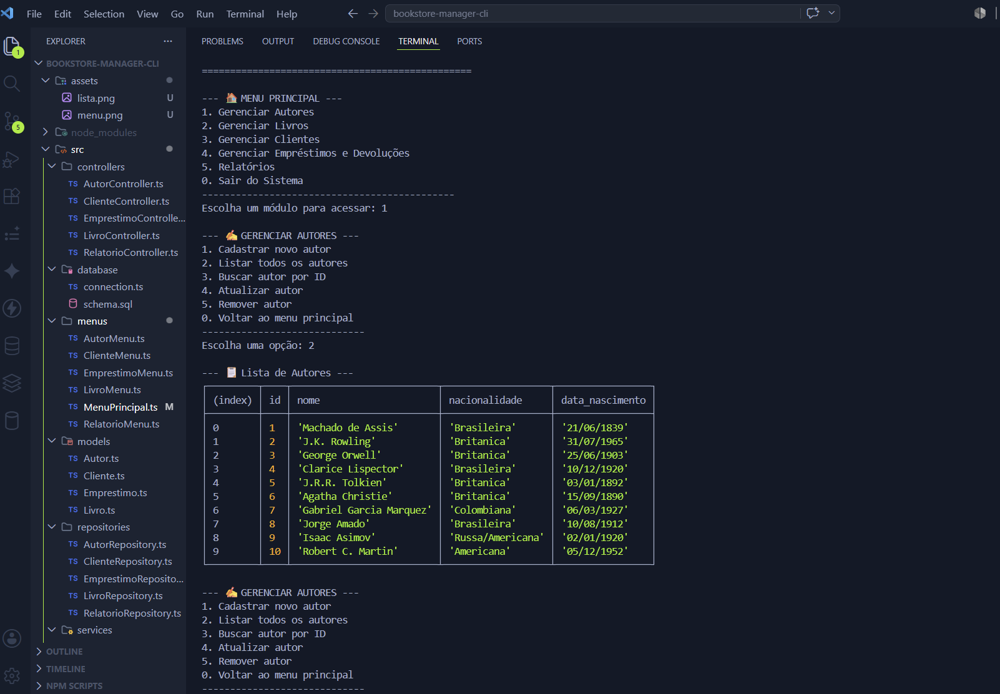
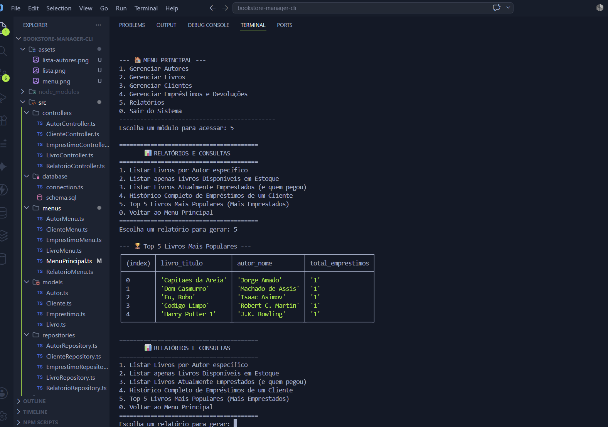
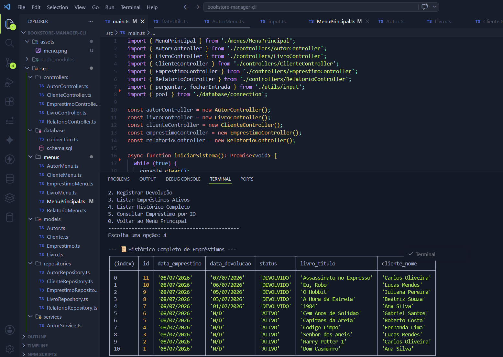
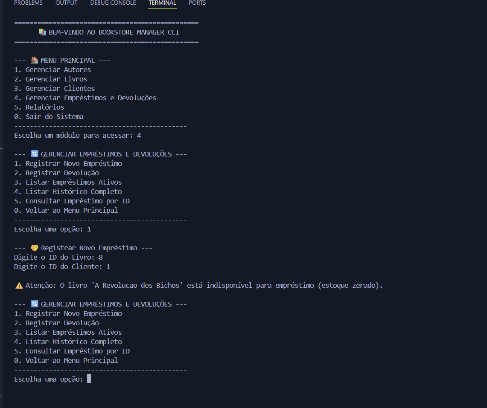
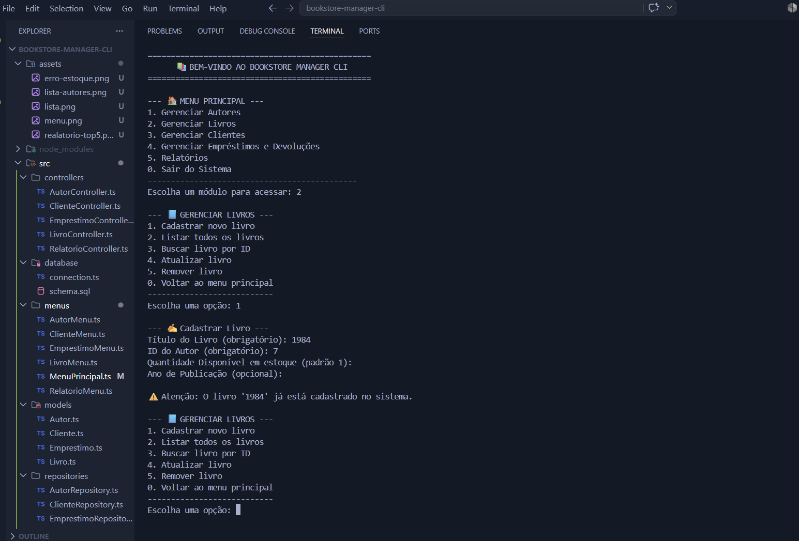

# 🏢 BookStore Manager CLI 📚

Projeto Final Avaliativo referente ao **Módulo 01** do curso de formação **SC Tech** (Desenvolvedor Back End Node).

Uma aplicação de linha de comando (CLI) interativa e robusta desenvolvida em **Node.js** com **TypeScript** e banco de dados relacional **PostgreSQL**. O sistema permite o gerenciamento completo de uma livraria, realizando o controle de estoque automatizado, cadastro de clientes, vínculo de autores e consultas relacionais complexas, tudo em tempo real direto no terminal.

---

## 🎯 Objetivo do Projeto

O objetivo deste projeto é consolidar os conhecimentos de Engenharia de Software Moderna do Módulo 01, simulando a rotina administrativa de uma livraria real. O sistema substitui registros manuais por uma aplicação CLI, aplicando programação orientada a objetos (POO), arquitetura limpa em camadas e modelagem de banco de dados relacional, garantindo a integridade dos dados e tratamento assíncrono de regras de negócio.

---

## 🛠️ Competências Desenvolvidas

* **TypeScript & POO:** Classes tipadas, interfaces robustas e encapsulamento de lógica.
* **Banco de Dados Relacional (PostgreSQL):** Modelagem de dados, chaves primárias/estrangeiras (`PK/FK`) e restrições de unicidade (`UNIQUE`).
* **Consultas Avançadas em SQL:** Utilização de agregações (`JOIN`, `COUNT`, `GROUP BY`, `LIMIT`) para geração de relatórios gerenciais complexos.
* **Tratamento de Exceções:** Implementação de classe customizada `AppError` para prevenção contra falhas de regras de negócio sem fechar a aplicação.
* **Versionamento Semântico:** Histórico Git organizado baseado no fluxo GitFlow (branches semânticas).

---

## 🚀 Tecnologias Utilizadas

* **[Node.js](https://nodejs.org/)** — Ambiente de execução JavaScript no servidor
* **[TypeScript](https://www.typescriptlang.org/)** — Superset tipado para segurança em tempo de compilação
* **[PostgreSQL](https://www.postgresql.org/)** — Banco de dados relacional de alta performance
* **[`pg` (node-postgres)](https://node-postgres.com/)** — Driver de conexão assíncrona com pool de queries
* **[`dotenv`](https://github.com/motdotla/dotenv)** — Gerenciamento seguro de credenciais de ambiente
* **[`ts-node`](https://typestrong.org/ts-node/)** — Compilação e execução direta em ambiente de desenvolvimento

---

## ⚠️ Requisitos para Execução

Antes de clonar e executar o projeto, certifique-se de ter instalado em sua máquina:

* [Node.js](https://nodejs.org/en/) (Versão LTS recomendada, 18+)
* [PostgreSQL](https://www.postgresql.org/download/) rodando localmente na porta padrão (`5432`)
* [Git](https://git-scm.com/)

---

## 💻 Instalação e Configuração

**1. Clone o repositório:**
```bash
git clone https://github.com/MariaAlineMees/bookstore-manager-cli.git
cd bookstore-manager-cli
```

**2. Instale as dependências:**
```bash
npm install
```

**3. Configure as Variáveis de Ambiente:**
Renomeie o arquivo `.env.example` na raiz do projeto para `.env` e preencha com as suas configurações locais.
> **Atenção:** Certifique-se de criar o banco de dados vazio chamado `bookstore_db` no seu PostgreSQL antes de continuar.

```dotenv
DB_USER=seu_usuario_postgres
DB_PASSWORD=sua_senha
DB_HOST=localhost
DB_PORT=5432
DB_NAME=bookstore_db
```

**4. Criação das Tabelas e População de Dados:**
Para configurar a estrutura do banco e inserir os dados de teste, você pode escolher uma das duas opções:

* **Opção A (Via Terminal - Recomendado):**
  Certifique-se de que o banco `bookstore_db` existe e execute:
  ```bash
  psql -U postgres -d bookstore_db -f src/database/schema.sql
  ```
  *(Nota: O terminal pode solicitar a senha do seu usuário do banco).*

* **Opção B (Via Interface Gráfica - pgAdmin / DBeaver):**
  1. Conecte-se ao `bookstore_db`.
  2. Abra uma "Query Tool".
  3. Cole e execute todo o conteúdo do arquivo `src/database/schema.sql`.

---

## ▶️ Execução

Para iniciar o sistema interativo no terminal, execute o comando:
```bash
npm run dev
```

---

## 🏛️ Arquitetura do Projeto

O projeto foi rigorosamente estruturado em camadas para promover a separação de responsabilidades (princípios SOLID):

* **Menus:** Isola a interface com o usuário (CLI), exibição de tabelas e menus de navegação.
* **Controllers:** Recebem a entrada do terminal e orquestram a chamada aos serviços correspondentes.
* **Services:** Concentram as regras de negócio e validações antes de qualquer operação no banco.
* **Repositories:** Isolam a comunicação direta com o PostgreSQL, executando consultas SQL puras e parametrizadas.
* **Models:** Representam as tipagens e os contratos de dados das entidades (POO).
* **Utils & Database:** Camadas de infraestrutura responsáveis pela conexão com o banco e ferramentas transversais (como tratamento de exceções).

---

## 📂 Estrutura de Pastas

```plaintext
BOOKSTORE-MANAGER-CLI/
├── assets/                     # Imagens e capturas de tela para a documentação
├── src/
│   ├── controllers/            # Recebem a entrada do terminal e orquestram as chamadas
│   │   ├── AutorController.ts
│   │   ├── ClienteController.ts
│   │   ├── EmprestimoController.ts
│   │   ├── LivroController.ts
│   │   └── RelatorioController.ts
│   ├── database/               # Conexão com o banco de dados e script de criação (DDL/DML)
│   │   ├── connection.ts
│   │   └── schema.sql
│   ├── menus/                  # Interface visual, renderização de tabelas e captura de opções
│   │   ├── AutorMenu.ts
│   │   ├── ClienteMenu.ts
│   │   ├── EmprestimoMenu.ts
│   │   ├── LivroMenu.ts
│   │   ├── MenuPrincipal.ts
│   │   └── RelatorioMenu.ts
│   ├── models/                 # Classes, interfaces e tipagens estáticas das entidades
│   │   ├── Autor.ts
│   │   ├── Cliente.ts
│   │   ├── Emprestimo.ts
│   │   └── Livro.ts
│   ├── repositories/           # Executam o SQL puro e parametrizado direto no PostgreSQL
│   │   ├── AutorRepository.ts
│   │   ├── ClienteRepository.ts
│   │   ├── EmprestimoRepository.ts
│   │   ├── LivroRepository.ts
│   │   └── RelatorioRepository.ts
│   ├── services/               # Lógica de negócio, validações de regra e controle de estoque
│   │   ├── AutorService.ts
│   │   ├── ClienteService.ts
│   │   ├── EmprestimoService.ts
│   │   ├── LivroService.ts
│   │   └── RelatorioService.ts
│   ├── utils/                  # Ferramentas auxiliares e tratamento customizado de exceções
│   │   ├── AppError.ts
│   │   ├── DateUtils.ts        # Utilitário para formatação de datas (Padrão Brasileiro)
│   │   └── input.ts
│   └── main.ts                 # Ponto de entrada central (arranque da aplicação)
├── .env / .env.example         # Variáveis de ambiente e credenciais locais do banco
├── .gitignore
├── package-lock.json
├── package.json                # Gerenciador de dependências e scripts de execução
├── tsconfig.json               # Configurações estritas do compilador TypeScript
└── README.md                   # Documentação oficial do sistema
```

---

## ✨ Funcionalidades Principais

✍️ **Gerenciamento de Autores:** Cadastro, listagem, consulta, atualização e remoção.

📘 **Catálogo de Livros:** CRUD completo com controle de quantidade em estoque e vínculo obrigatório a um Autor.

👥 **Registro de Clientes:** Cadastro com validação automática que impede e-mails duplicados.

🔄 **Empréstimos Inteligentes:**
* Checagem se o cliente e o livro existem no banco antes do registro.
* Bloqueio automático se o exemplar possuir `quantidade_disponivel <= 0`.
* Baixa automática no estoque ao concretizar um empréstimo.

📥 **Devoluções de Exemplares:** Atualização do status para DEVOLVIDO, registro da data e reposição automática do estoque.

📊 **Relatórios Relacionais (Consultas SQL Avançadas):**
* Livros específicos de um autor (`JOIN`).
* Listagem de livros com estoque disponível.
* Tabela de livros atualmente emprestados combinada com dados do cliente.
* 🏆 **Top 5 Livros Mais Populares:** Agregação sofisticada identificando os livros mais emprestados (`JOIN`, `COUNT`, `GROUP BY`, `ORDER BY`, `LIMIT`).

---

## 📸 Tratamento de Erros e Regras de Negócio

O sistema implementa validações robustas (via `AppError`) garantindo estabilidade:

1. **Restrição de Estoque Zerado**
* **Ação:** Tentar registrar empréstimo do livro 'A Revolução dos Bichos' (estoque 0).
* **Comportamento:** O serviço bloqueia a ação sem fechar a aplicação:
> ❌ **Erro de Validação:** O livro 'A Revolução dos Bichos' está indisponível para empréstimo (estoque zerado).

2. **Integridade de Chave Estrangeira**
* **Ação:** Cadastrar um livro com um `autor_id` que não existe.
* **Comportamento:**
> ⚠️ **Atenção:** O Autor com ID informado não existe no banco de dados.

---

## 💡 Exemplos de Utilização

Abaixo estão as telas do sistema em funcionamento, demonstrando a interface interativa, a formatação de dados e o tratamento de regras de negócio.

**1. Tela Inicial e Menu Principal**
*(Comprova a execução via CLI e navegação estruturada)*


**2. Listagem de Entidades (Formatada com DateUtils)**
*(Demonstra a aplicação de utilitários e renderização de tabelas)*


**3. Relatório Gerencial Complexo**
*(Comprova o uso de agregações SQL: JOIN, COUNT, GROUP BY e LIMIT)*


**4. Visão Geral de Empréstimos**
*(Cruzamento de dados entre Clientes, Livros e Empréstimos)*


**5. Tratamento de Exceções: Regra de Negócio**
*(Bloqueio de empréstimo por falta de estoque disponível)*


**6. Tratamento de Exceções: Banco de Dados**
*(Prevenção de duplicidade baseada em restrição UNIQUE)*


---

## 📋 Planejamento e Apresentação

O planejamento, organização de tarefas e acompanhamento do progresso deste projeto foram gerenciados utilizando a metodologia Kanban.

🔗 **[Clique aqui para acessar o Kanban do Projeto](https://github.com/users/MariaAlineMees/projects/2)**

---

## ✒️ Autoria
Projeto desenvolvido individualmente por **Maria Aline Mees**.
